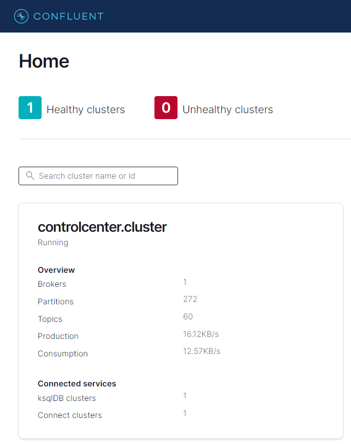

# Lab 1: Run Confluent Platform all in one demo

Covers Docker, Kafka and the Confluent Platform.

Download and install [Docker Desktop](https://www.docker.com/products/docker-desktop/).

Clone this repository (which is a direct copy of [Confluent cp-all-in-one](https://github.com/confluentinc/cp-all-in-one/tree/7.2.2-post/cp-all-in-one))

Execute the `run.sh` script:
```
./run.sh
```

Open the Confluent Platform Control Center in you browser: [http://localhost:9021/](http://localhost:9021/)

You should see the following page in your browser:



To destroy the environment, do:
```
./destroy.sh
```
